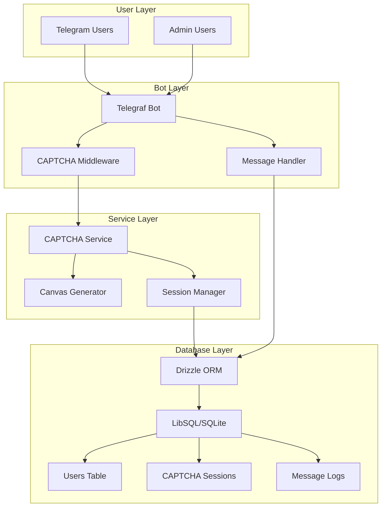
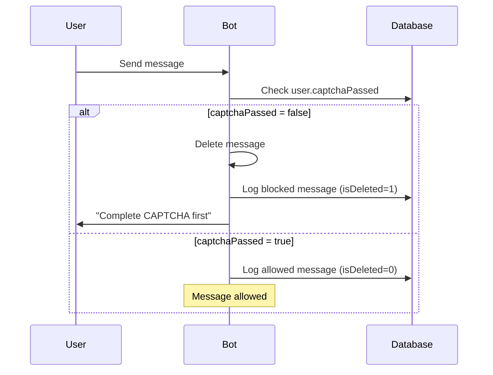

# Telegram CAPTCHA Bot

A Telegram bot that requires users to complete a CAPTCHA verification before they can send messages in a group.

## ✨ Features

- 🔐 **Visual CAPTCHA System**: Canvas-generated image CAPTCHAs with noise and character rotation
- 🛡️ **Message Protection**: Automatic message deletion for unverified users
- ⏰ **Rate Limiting**: 30-second cooldown between CAPTCHA requests
- 🗄️ **Database Tracking**: User verification status and message logging
- 👮 **Admin Commands**: Statistics and user management for administrators
- 📝 **Message Logging**: Track blocked and allowed messages
- 🔄 **Soft Deletion**: Safe data management with recovery options

## 🏗️ Tech Stack

- **Framework**: [Telegraf](https://telegraf.js.org/) - Telegram Bot API framework
- **Runtime**: Node.js
- **Database**: [Turso](https://turso.tech/)
- **Image Processing**: [Canvas API](https://github.com/Automattic/node-canvas) - CAPTCHA image generation
- **Language**: TypeScript

## 📊 Architecture



## 📝 Database Schema

### Users Table
| Field | Type | Description |
|-------|------|-------------|
| id | TEXT | Primary key (user_${telegramId}) |
| telegramId | TEXT | Telegram user ID (unique) |
| username | TEXT | Telegram username |
| firstName | TEXT | User's first name |
| lastName | TEXT | User's last name |
| captchaPassed | BOOLEAN | Verification status (default: false) |
| captchaAttempts | INTEGER | Number of attempts (default: 0) |
| lastCaptchaAttempt | TIMESTAMP | Last attempt timestamp |
| createdAt | TIMESTAMP | Record creation time |
| updatedAt | TIMESTAMP | Last update time |
| isDeleted | INTEGER | Soft deletion flag (default: 0) |

### CAPTCHA Sessions Table
| Field | Type | Description |
|-------|------|-------------|
| id | TEXT | Session ID (32-char hex) |
| userId | TEXT | Reference to users.id |
| captchaText | TEXT | Expected CAPTCHA answer |
| expiresAt | TIMESTAMP | Session expiration (5 minutes) |
| verified | BOOLEAN | Verification status (default: false) |
| createdAt | TIMESTAMP | Session creation time |
| updatedAt | TIMESTAMP | Last update time |
| isDeleted | INTEGER | Soft deletion flag |

### Message Logs Table
| Field | Type | Description |
|-------|------|-------------|
| id | INTEGER | Auto-increment primary key |
| userId | TEXT | Reference to users.id |
| messageText | TEXT | Message content or "[non-text message]" |
| createdAt | TIMESTAMP | Message timestamp |
| updatedAt | TIMESTAMP | Last update time |
| isDeleted | INTEGER | 0 = allowed, 1 = blocked |

## 🚀 Installation

### Prerequisites
- LibSQL database (Turso) or SQLite
- Telegram Bot Token from [@BotFather](https://t.me/botfather)

### Setup Steps

1. **Clone and install**
```bash
git clone https://github.com/WuChenDi/telegram-capcha.git
cd telegram-capcha
bun install
```

2. **Environment Configuration**
```bash
cp .env.example .env
```

Configure your `.env` file:
```env
# Required: Telegram Bot Token
BOT_TOKEN=your-telegram-bot-token-here

# Required: Database Configuration
LIBSQL_URL=libsql://your-database-url
LIBSQL_AUTH_TOKEN=your-auth-token
```

3. **Database Setup**
```bash
# Generate and apply migrations
bun run db:gen
bun run db:push
```

4. **Start the bot**
```bash
bun run dev
```

## 🎯 Usage

### Bot Commands

#### For All Users
- `/start` - Begin CAPTCHA verification process

#### For Administrators Only
- `/stats` - View bot statistics
- `/reset_user <user_id>` - Reset specific user's verification
- `/reset_user` (reply to message) - Reset the replied user

### User Flow

1. **New user joins group** → User status: `captchaPassed: false`
2. **User sends any message** → Bot deletes message and prompts for CAPTCHA
3. **User runs `/start`** → Bot generates and sends CAPTCHA image
4. **User enters CAPTCHA text** → Bot verifies and updates status
5. **Verification successful** → User can send messages freely

### Message Protection



## ⚙️ CAPTCHA System

### Image Generation
- **Canvas Size**: 200x80 pixels
- **Font**: Bold 40px Arial
- **Background**: Light gray (#f0f0f0)
- **Noise**: 6 random lines + 100 colored dots
- **Text Effects**: Character rotation (±0.4 radians) and vertical offset

### Security Features
- **Character Set**: `ABCDEFGHJKLMNPQRSTUVWXYZ23456789` (excludes confusing chars)
- **Text Length**: 6 characters
- **Session Expiry**: 5 minutes
- **Rate Limiting**: 30-second cooldown between requests
- **Session Storage**: In-memory Map for active sessions

### Code Structure

#### CAPTCHA Service (`captcha.ts`)
```typescript
// Key functions implemented:
generateRandomText(length: number = 6): string
generateCaptchaImage(text: string): Buffer
createCaptchaSession(userId: string): Promise<CaptchaSessionResult>
verifyCaptcha(sessionId: string, userInput: string): Promise<VerifyResult>
```

<!-- ## 🔧 Configuration

### Environment Variables
```env
BOT_TOKEN=              # Telegram bot token (required)
LIBSQL_URL=            # Database URL (required)
LIBSQL_AUTH_TOKEN=     # Database auth token (required for remote)
```

### Hardcoded Settings (in code)
```typescript
// Rate limiting
const cooldownMs = 30000; // 30 seconds

// CAPTCHA expiry
const expiryMs = 5 * 60 * 1000; // 5 minutes

// Image dimensions
const width = 200, height = 80;

// Character set
const chars = "ABCDEFGHJKLMNPQRSTUVWXYZ23456789";
``` -->

## 📊 Admin Statistics

The `/stats` command shows:
- **Total users**: Count of all users
- **Verified users**: Users with `captchaPassed = true`
- **Total CAPTCHA attempts**: Sum of all attempts
- **Messages blocked (24h)**: Recent blocked messages count

Example output:
```
📊 Bot Statistics

👥 Total users: 150
✅ Verified users: 142
🔄 Total CAPTCHA attempts: 167
🚫 Messages blocked (24h): 8
```

## 🛠️ Development

### Project Structure
```
telegram-captcha-bot/
├── src/
│   ├── index.ts           # Main bot logic
│   ├── captcha.ts         # CAPTCHA generation/verification
│   ├── db.ts              # Database connection
│   └── database/
│       └── schema.ts      # Database schema
├── .env.example
├── package.json
└── tsconfig.json
```

### Key Components

#### Main Bot Logic (`index.ts`)
- `getOrCreateUser()` - User management
- `requireCaptcha()` - Middleware for message filtering
- Command handlers: `/start`, `/stats`, `/reset_user`
- Message logging and deletion

#### Database Schema (`schema.ts`)
- Tracking fields: `createdAt`, `updatedAt`, `isDeleted`
- Type definitions for all tables
- Foreign key relationships

## 📜 License

[MIT](./LICENSE) License &copy; 2023-PRESENT [wudi](https://github.com/WuChenDi)
